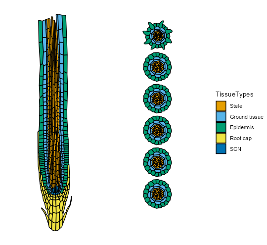
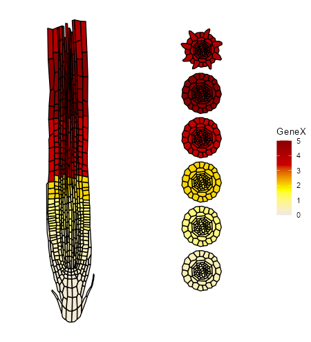
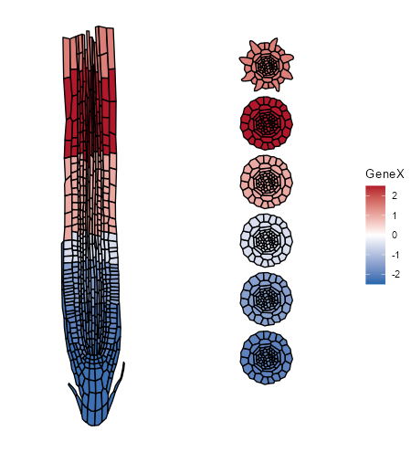

# ggRootCellAtlas

Plot cell annotations and gene expression on realistic layouts of the
*Arabidopsis thaliana* root. Every figure shows one longitudinal section and
six cross-sections along the root, so you can see a cell type or an expression
pattern in space, cell by cell.

<p align="center">
  
</p>

The cross-sections run from the root tip upwards:

| Section | Zone |
|---|---|
| `m1`, `m2` | early and late meristem |
| `t` | transition zone |
| `e1`, `e2` | early and late elongation zone |
| `d` | differentiation zone |

## Installation

```r
# install.packages("remotes")
remotes::install_github("MironovaLab/ggRootCellAtlas")
```

This also installs [ggPlantmap](https://github.com/leonardojo/ggPlantmap), which
draws the maps.

## Annotations

Colour the root by any of the annotation columns:

```r
library(ggRootCellAtlas)
ggRootCellAtlas_annotation("TissueTypes")
```

| Column | Groups | Examples |
|---|---:|---|
| `TissueTypes` | 5 | Stele, Ground tissue, Epidermis, Root cap, SCN |
| `Zones` | 6 | m, t, e, d, Root cap, SCN |
| `Sections` | 8 | m1, m2, t, e1, e2, d, Root cap, SCN |
| `TissueSubTypes` | 10 | Vasculature, Pericycle, Endodermis, Cortex, LRC |
| `CellTypes` | 20 | Xylem, Procambium, PPP, Atrichoblast, QC |
| `SubCellTypes` | 22 | Metaxylem, Procambium, PPP, Atrichoblast |
| `Atlas_reduced` | 47 | Cortex_m, Cortex_t, Cortex_e, Cortex_d |
| `Atlas` | 76 | Cortex_m1, Cortex_m2, Cortex_e1, Cortex_e2 |

`Atlas` and `Atlas_reduced` combine the cell type with the section or zone, and
match the cluster annotation of the single-cell root atlas.

## Gene expression

Show the average expression of a gene per cell group. With a Seurat object
annotated with one of the columns above:

```r
avg_exp <- Seurat::AverageExpression(seurat_object, assays = "RNA", group.by = "Atlas")
ggRootCellAtlas_expression(avg_exp, "AT1G01010")
```

If the groups are not `Atlas`, say which column they match, e.g.
`Annotation = "CellTypes"`.

`avg_exp` can also be a matrix, sparse matrix or data frame with genes in rows
and groups in columns. Group names are matched ignoring case and punctuation,
so names changed by Seurat (`Cortex-m1`, `Young.LRC`) still match the map.
Cells whose group has no value are drawn in dark grey.

### Colour scales

<table>
  <tr>
    <td width="50%"></td>
    <td width="50%"></td>
  </tr>
  <tr>
    <td>Default scale, snow2 → red4</td>
    <td><code>midpoint = 0</code>, e.g. for fold changes</td>
  </tr>
</table>

<sub>Both panels use made-up values to show the scales.</sub>

```r
# fix the colour range; values outside it take the colour of the nearest limit
ggRootCellAtlas_expression(avg_exp, "AT1G01010", c1 = 0, c2 = 5)

# your own gradient, from low to high
ggRootCellAtlas_expression(avg_exp, "AT1G01010", colours = c("white", "darkgreen"))

# diverging scale centred on 0 (blue → white → red), e.g. for log2 fold changes
# or PCA scores
ggRootCellAtlas_expression(lfc, "AT1G01010", midpoint = 0)
```

### Annotation colours

The default palette, `okabe_ito_pal()`, is colour-blind safe for up to 11
groups (`TissueTypes`, `Zones`, `Sections`, `TissueSubTypes`). Columns with
more groups use the standard ggplot2 hues. To choose colours yourself, pass a
palette function, a vector of colours, or a vector named by group:

```r
ggRootCellAtlas_annotation("TissueTypes", palette = c(
  Epidermis = "#E69F00", "Ground tissue" = "#009E73", Stele = "#CC79A7",
  "Root cap" = "#56B4E9", SCN = "#D55E00"
))
```

Both functions take `na.colour` to change the colour of cells without a value
or annotation (default dark grey).

## Functions

| Function | Purpose |
|---|---|
| `ggRootCellAtlas_annotation()` | Colour the root by an annotation column |
| `ggRootCellAtlas_expression()` | Colour the root by the expression of one gene |
| `root_maps()` | The seven maps as a list of data frames |
| `generate_common_palette()` | One named colour per group, shared across maps |
| `okabe_ito_pal()` | The default colour-blind safe palette |

Both plotting functions return a patchwork object, so the figure can be saved
with `ggplot2::ggsave()` or changed further with ggplot2 and patchwork.

## Authors

Maria Savina and Victoria Mironova ([MironovaLab](https://github.com/MironovaLab)).
Released under the MIT licence.
